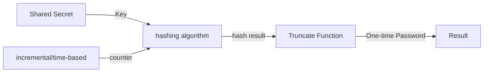

# Time-based One-time Password (TOTP) Demystified

## Introduction

Time-based One-time Password (TOTP), standardized under [RFC 6238](https://datatracker.ietf.org/doc/html/rfc6238) is a crucial component in the realm of online security, serving as a cornerstone for the Initiative for Open Authentication (OATH). TOTP is widely employed in various two-factor authentication (2FA) systems, providing an additional layer of protection beyond traditional password mechanisms. This article delves into the TOTP algorithm, explaining its foundations and highlighting key implementation aspects.

## Understanding the Algorithm

### Background: HMAC-based OTP (HOTP)

Before delving into TOTP, it's essential to comprehend the HMAC-based OTP (HOTP) algorithm, standardized under [RFC 4226](https://datatracker.ietf.org/doc/html/rfc4226). HOTP relies on an increasing counter value (C) and a static symmetric key (K) shared between the token and the validation service. The HOTP formula is expressed as:

$$
HOTP(K,C) = Truncate(HMACSHA1(K,C))
$$

### Key Generation

For successful authentication, the prover and verifier must share the same secret or possess the knowledge of a secret transformation. This shared secret (K) is unique to each HOTP generator.

### Counter Generation

Unlike HOTP, TOTP's counter generation is tied to the current Unix time. The counter (C) is calculated as:

$$
counter = \frac{(Current Unix time - T0)}{X}
$$

Where T0 is the initial reference time, and X is the time step. The recommended time step is 30 seconds, striking a balance between security and practicality.

For example, with T0 = 0 and Time Step X = 30, T = 1 if the current Unix time is 59 seconds, and counter = 2 if the current Unix time is 60 seconds.

### Hash Algorithm

While HOTP employs HMAC-SHA-1, TOTP implementations have the flexibility to use stronger hash functions such as HMAC-SHA-256 or HMAC-SHA-512, enhancing security based on SHA-256 or SHA-512 hash functions.

### Truncate Function

The truncate function in TOTP is fundamental to obtaining a secure and standardized code length. Its purpose is to extract a specific number of digits from the hash output, ensuring consistency in the generated one-time password (OTP).

The input to the truncate function comprises two components:

- The digits to be generated (Implementations MUST extract a minimum of a 6-digit code, and possibly 7 and 8-digit codes).
- The hash generated by the HMAC-SHA-1, HMAC-SHA-256, or HMAC-SHA-512 function, depending on the chosen hash algorithm.

The following steps outline the process:

1. **Determine Offset:**
   - Let Offset be the low-order 4 bits of the hash.()
   - Convert the offset to decimal, ensuring it falls within the range [0..15].

2. **Extract 31 Bits:**
   - Let P be the last 31 bits of hash[Offset]...hash[Offset+3].

3. **Generate Truncated Result:**
   - The truncate result is calculated as $P \mod 10^{digits}$, where 'digits' is the desired length of the one-time password.

## Implementation Examples

### Java

For Java implementations, RFC standards offer [sample code](https://datatracker.ietf.org/doc/html/rfc6238#section-5.4) that aligns with TOTP specifications.

### C#

For C# developers, [OTP.NET](https://github.com/kspearrin/Otp.NET) provides a reliable library for TOTP implementation.

## Conclusion

Understanding the intricacies of TOTP is pivotal in appreciating its role in modern authentication systems. By combining the time-based element with cryptographic principles, TOTP ensures robust security, making it a valuable asset in the ongoing efforts to safeguard online interactions. Developers can leverage standardized libraries and follow established practices to seamlessly integrate TOTP into their applications, enhancing user authentication mechanisms.
